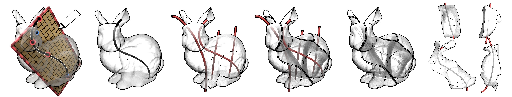

# optical-pathways-fdm

Optical Pathway Design Tool in Blender

## Prerequisites

You need to download the specific Blender version that has the experimental voronoi geometry node(this feature us not merged yet)
### Windows
You can find the built Blender app zip [here](https://drive.google.com/file/d/1s0pH3GEbw940evF17Fh_0MFWYgYtpKBS/view?usp=drive_link)

### Mac and Linux
You can checkout the [development branch](https://projects.blender.org/bebop_artist/blender/src/branch/voronoi_node) and the [PR](https://projects.blender.org/blender/blender/pulls/129032), then follow the [Building Blender](https://developer.blender.org/docs/handbook/building_blender/) page to build it for your system. 

## Installation

From the [releases page](https://github.com/ComicAddict/optical-pathways-fdm/releases) download the `curve_partition_addon.zip`. Thenu use "Install from Disk" option in _Blender > Edit > Preferences > Add-ons_ and select the downloaded `curve_partition_addon.zip` to install.

## Usage

From `3D Viewport` Sidebar you can access the addon under `Curve Partitioning Tool`. Here is the list of operators:

- `Add Canvas and Draw Curves`: After clicking you need to select two points on surfaces, then it places a 2D canvas. Then you need to determine the orientation of the 2D canvas with 'RIGHT MOUSE'. Once the canvas is set, user can draw curves on 2D canvas. Once done with the drawing 'ESC' to finalize drawing.
- `Apply Partitioning`: Applies a geometry node modifier that partitions the model from the curves defined in "CHANNELS" collection
- `Add Shape:Shape Block`
- `Add One:Many Block`
- `Add Transform Block`
- `Apply 2D Printing Layout`: Applies transformations to selected objects partition such that channels lie in a plane

## `BL_IDNAME` for Operators (Python API)
- `curve_partition.modal_planar_curve_drawing`
- `curve_partition.apply_partition`
- `curve_partition.apply_layout`
- `curve_partition.add_one2many`
- `curve_partition.add_shape2shape`
